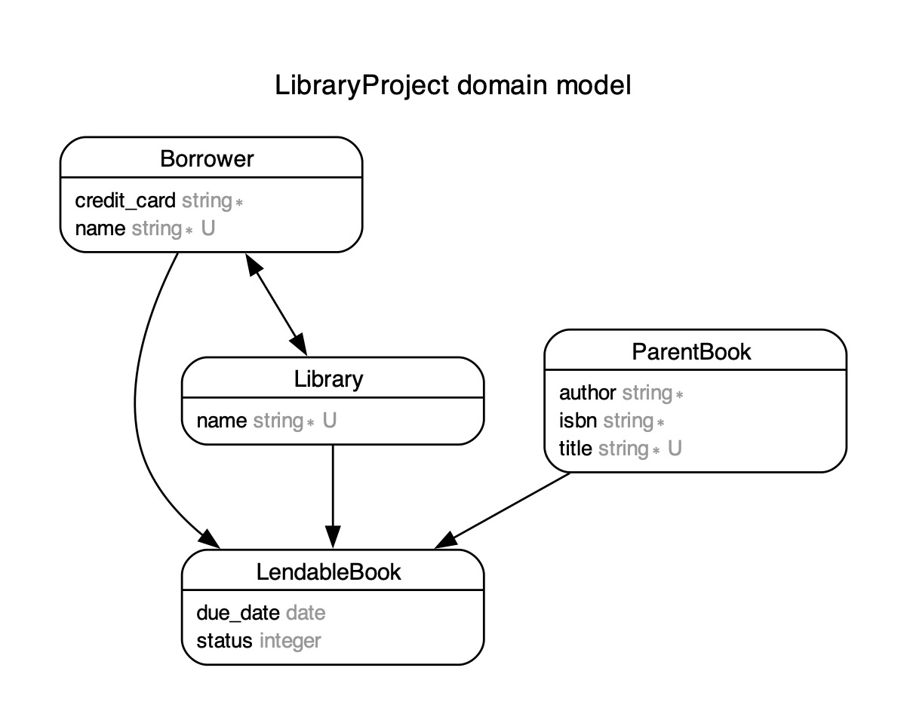

# README

ruby version 3.1.1
rails version 6.1.7.6

## Setup Instructions
```
  rake db:prepare
  rails s
```

## Model Diagram


[View Endpoint Documentation](endpoints.md)

[View Project Requirements](requirements.md)

[View Edge Case Discussion](edge_case.md)

## Rspec
 There are some tests, but I ran out of time to do a full test suite of the lending/returning logic

 `rspec`

## Documentation
  I have sample requests and responses shared above in the [endpoints page](endpoints.md).  I also enjoy using [Swagger](https://swagger.io/docs/) documentation as a prettier/more rounded documentation option for an api.